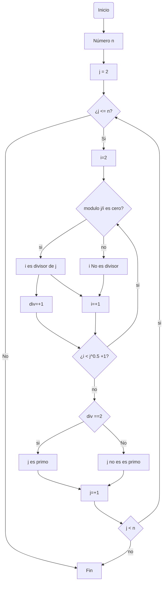
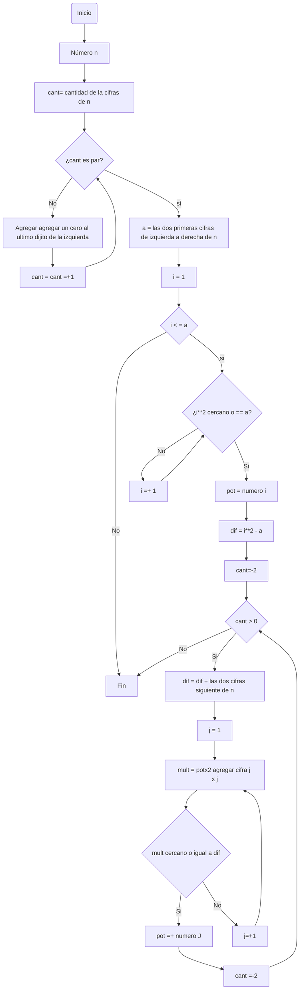

# Reto_3
En este repositorio se desarrolla el reto 3, aunque sé que en algunas partes se debe hacer correciones :)
## Algoritmo para obtener los números primos hasta n
### Pseudocodigo
```
[variables]
n : entero
i : entero
j : entero
div: entero
inicio
  j := 2
  div := 0
  Mientras ( j <=  n) hacer
      Si 
	 i : = 2
	 Mientras (i < ((j^0.5)+1) hacer
    	    Si modulo(n,i) == 0 entonces
      	       (i es divisor de j)
      	    div: =+1
            sino
      	       (i no es divisor de j)
    	    i := i + 1
         Fin de mientras
     	Mientras (div ==2 ) hacer
     	   Si
	      mostrar ("j es numero primo")
     	   sino 
	      ("j no es primo")
   	Fin mientras
     j : =+1
   sino 
   Fin mientras
fin
```

### Diagrama de Flujo 

## Algoritmo para hallar raíces cuadradas 
### Pseudocodigo
```
[variables]
n : entero positivo
cant : cantidad de cifras de n
a : entero
i : entero
pot : entero = 0
dif : entero = 0
mult : entero = 0
inicio
   Si (cant es par)
      a = las dos cifras de n de izquierda a derecha
      i = 1
      Mientras (i < a)
	Si (i**2 cercano o igual a "a")
	   pot = numero i
	   dif = i**2 -a
	   cant =-2
	      Mientras (cant > 0)
		dif = dif se le agraga las dos cigras siguiente de numero n
		j = 1
		mult = ((potx2) agregar cifra de j ) x j
		Si (mult cercano o igual a dif) hacer
		   pot =+ numero j
		   cant =-2
		sino (j=+1)
	      Fin mientras
	sino (i=+1)
      Fin mientras
fin
```
### Diagrama de Flujo

